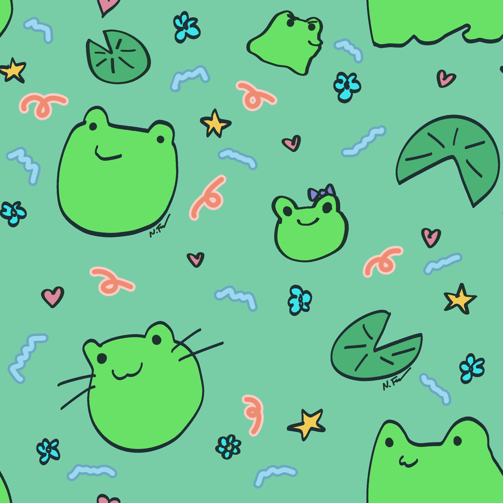
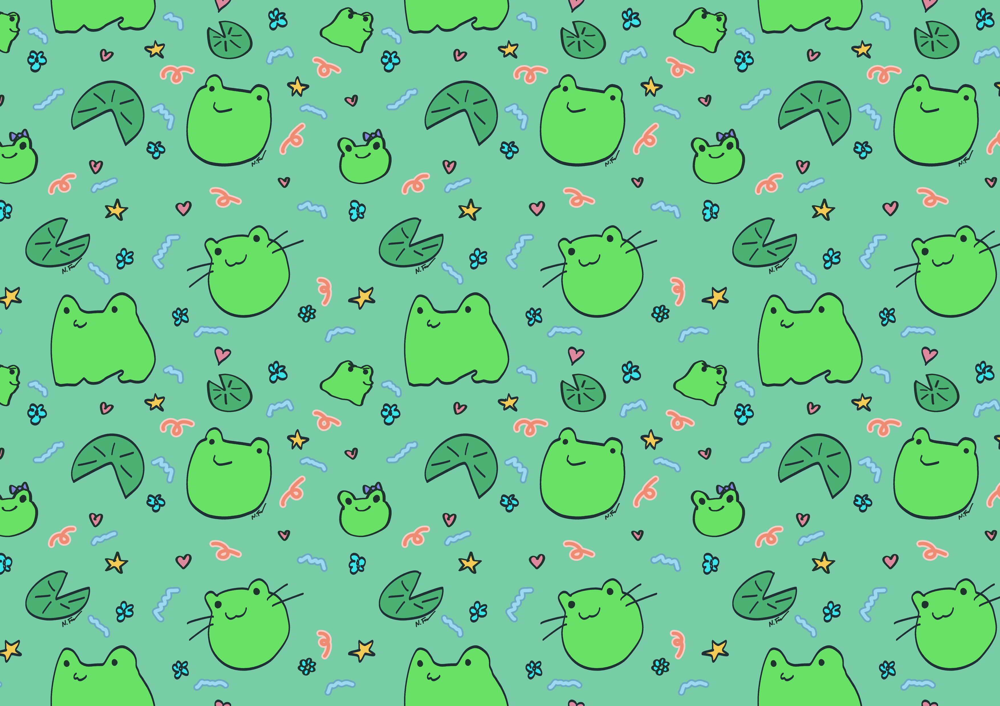
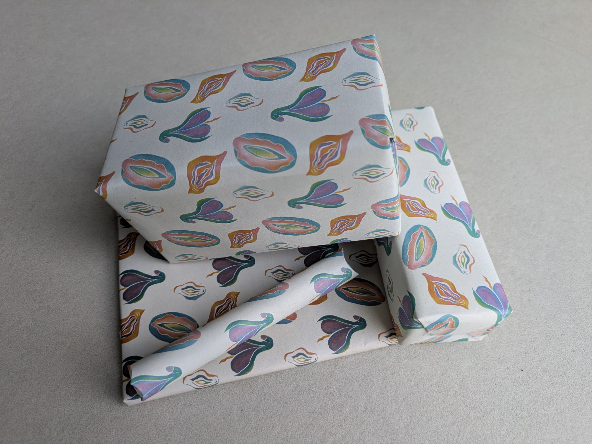

# tilegenerator
This is a small generator that creates seamless wallpapers and print backgrounds from a single tile image with customizable tiling, smart scaling and preset resolutions (4K, phone, A4 or custom size).

This tool is essentially equivalent to using **Filter → Map → Tile** in GIMP, but automated. It removes the need to manually calculate output dimensions, avoids unnecessary rescaling steps, and provides convenient presets for commonly used output formats.

## Example

### Input tile



### Command

```bash
python src/tilewallpaper.py img/frog.png a4_landscape.png --tiles 2x1 --preset a4-landscape
```

### Output



Disclaimer:
This drawing is only a demonstration example and does not represent my usual art style. It mostly represents my mood while working on this project.

## Why I built this

I created this tool to automate the process of generating tiled pattern outputs for my art workflow. Instead of manually exporting multiple variations using image editing software like GIMP, this script allows fast and consistent generation of wallpapers, print files, and other pattern-based outputs.

For example you could print political motivated wrapping paper for your cousin who is an adult but still draws weiners on stuff.



High-resolution versions and commercial usage licenses of this pattern are available in my shop.

Etsy: (Link coming very soon..)

You can also follow my artwork and new releases here:

Instagram: [drawnlastnight](https://www.instagram.com/drawnlastnight?igsh=MXhtYWNmZnZhNDNucg==)


In the future I will also make a website for my art and host this tool with a cute frontend.

Please do not steal my frog art, if you use it tag me.

## License
The code is licensed under MIT License (see LICENSE file).
All artwork, pattern samples, and example images contained in this repository are under copyright by me. These assets are provided only for demonstration and testing of this software.

You may:
- Use the example artwork locally to test the software
- Modify the artwork for personal experimentation
You may NOT:
- Redistribute the artwork
- Use the artwork for commercial purposes
- Sell or distribute derivative artwork
- Upload the artwork to asset libraries, marketplaces, or stock platforms
- Present the artwork as your own work

If you share results created using the example artwork, proper credit or tagging is highly appreciated.

### Future Plans
I plan to create a website for my artwork and eventually host this tool online with a dedicated frontend interface.